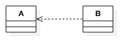
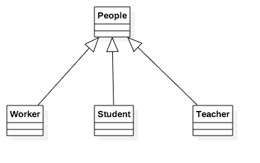
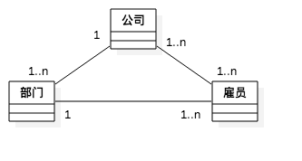
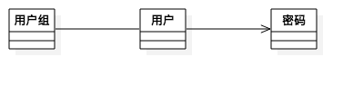
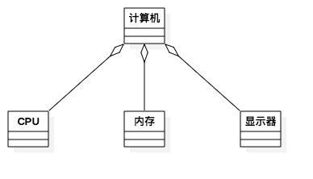
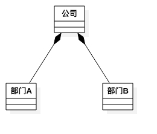
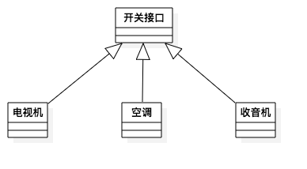

# 第03章 UML的关系

## 1.依赖关系

一个模型元素的变化会影响到另一个元素，则他们之间存在依赖关系。

## 2.类属关系

子类可以获取父类所有属性与方法。

## 3.关联关系

规定某一事物与另一事物存在联系。

  
### 3.1 角色与阶元

	角色：参与关联关系的泪
	阶元：有多少个对象参与关联

### 3.2 导航

关联关系是可以导航的，给定一端对象可以直接到达另一端对象。

关联关系可以有方向，单向的是有箭头实线，双向的没有箭头实线

	用户组 和 用户 是双向关联，即根据用户组可以找到用户，根据用户也能找到用户组
	用户 和 密码 是单向关联，即只能根据用户找到对应的密码，而不能根据密码找到用户

### 3.3 可见性

如果两个类之间存在关联关系，一个类的对象就可以看见并导航到另一个类的对象，除非有所限制，如 单向导航。

### 3.4 限定符

限定符是属性或属性列表，用来划分与某个对象通过关联关系连接的对象集。

### 3.5 接口说明符

用来规定类或服务的操作集的说明符。

### 3.6 聚合关系

表示类之间是 整体 与 部分 关系。代表 has－a(拥有)， 即作为整体时拥有作为部分的对象。

### 3.7 组合关系

组合是聚合的变种，加入了重要的语义，在组合关系中，整体与部分之间具有很强的所有关系和一致的生命周期。 整体被破坏时，部分也被破坏。

## 3.4 实现关系

实现关系是分类器之间的语义关系，其中一个分类器规定协议，另一个分类器实现协议。

	PS: 图中应该为虚线

