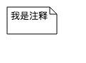
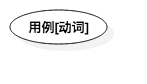

# 第04章 UML的元素

## 1.注释

注解作用，注释不会改变所依附的模型的含义。

## 2.参与者

参与者代表与系统交互的人，硬件设备 或 另一个系统。

	参与者可以进行的内容：
		1.只向系统输入信息
		2.只从系统接收信息
		3.既可以输入，有可以接收信息

## 3.用例

规定了系统或部分行为，描述了系统所执行的动作序列集，并为执行者产生了一个可供观察的结果。

## 4.协作

协作命名了彼此合作完成某个行为的类、接口和其他元素的群体。

~

~

~

~

~

~

~

~

